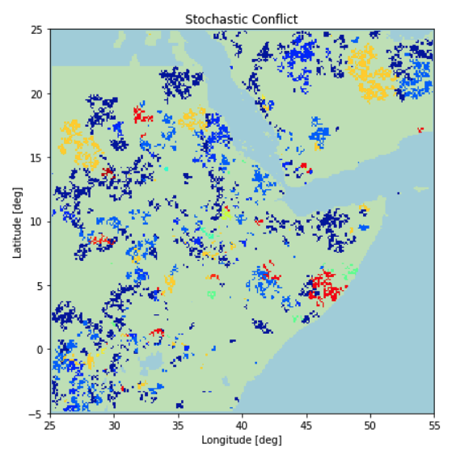

Stochastic Conflict Model
========



This grid-based, stochastic model simulates the triggering of conflict in areas where "unrest" is high, and its subsequent spreading and/or resolution based on measures of local and nonlocal connectivity.  This model has been written as a Python package that can be installed in a conda environment. 

There is also a Jupyter notebook (see notebook folder) which has a graphical user interface (GUI), with sliders and text boxes, for running the model.  Instructions for installing the package are included in the notebook.  Values from the GUI are written to the model's configuration file.  Model output can also be visualized within the notebook with special graphics routines that are included with the package.

The model can also be run at a Python command line or at a Unix prompt.  For example:
``` bash
  % cd stochastic_conflict_model 
  % python conflict --cfg_file './input_files/conflict.cfg'
```

This model is a work in progress and has not yet been calibrated against conflict data (e.g. number of fatalities, type of conflict) because of the difficulty in obtaining reliable data that is grid-based vs. aggregated for admininstrative regions.  We are investigating various data sources including ACLED and GDELT for this purpose.  Current applications and testing are for the Horn of Africa.

See the PDF in the docs folder for a more detailed description of the model and with references and a mathematical appendix.

This model is partially compliant with the Basic Model Interface (BMI).

The main model parameters are as follows:

### conflict emergence factor
This is a proportionality factor that is multiplied by the normalized unrest (U) to get the probability that conflict *emerges* in a given grid cell in the current timestep.  A real-valued number between 0 and 1.  Can be set with a slider in the GUI.
 
### conflict local spreading factor
This is a proportionality factor that is multiplied by the normalized local connectivity (C1) to get the probability that conflict *spreads* from a given grid cell to its nearest neighbors in the current timestep.  A real-valued number between 0 and 1.  Can be set with a slider in the GUI.

### conflict nonlocal spreading factor
This is a proportionality factor that is multiplied by the normalized nonlocal connectivity (C2) to get the probability that conflict *spreads* from a given grid cell to remote grid cells in the current timestep.  A real-valued number between 0 and 1.  Can be set with a slider in the GUI.

### conflict resolution probability
The probability that the conflict in any grid cell will be resolved in the current timestep.  A real-valued number between 0 and 1.  Can be set with a slider in the GUI.

### unrest grid
A spatial grid of values (2D array) that gives a measure of the "unrest", or potential for conflict to emerge, in each grid cell.  It depends on indicators such as population count, average rainfall rate, and many others.  This grid is currently pre-computed for the user as a function of several indicators.  It is fixed for each model run for a given region.  Must be in GeoTIFF format and all grids must have same dimensions.  If no grid is specified, a uniform (constant-valued grid) is used.

### local connectivity grid
This is a spatial grid of values (2D array) that gives a measure of the "local connectivty", or potential for conflict to spread, in each grid cell.  It depends on indicators such as accessibility, road density, etc..  This grid is currently pre-computed for the user as a function of several indicators.  It is fixed for each model run for a given region.  Must be in GeoTIFF format and all grids must have same dimensions.  If no grid is specified, a uniform (constant-valued grid) is used.

### nonlocal connectivity grid
This is a spatial grid of values (2D array) that gives a measure of the "nonlocal connectivty", or potential for conflict to spread to distant grid cells, in each grid cell.  It depends on indicators such as internet and cell phone access.  This grid is currently pre-computed for the user as a function of several indicators.  It is fixed for each model run for a given region.  Must be in GeoTIFF format and all grids must have same dimensions. If no grid is specified, a uniform (constant-valued grid) is used.


